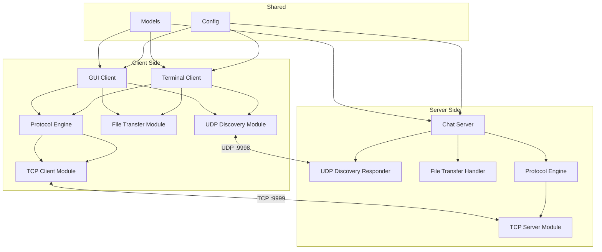

# 🏗️ Simple LAN Chat — Software Design Document

> **Project Title:** Simple LAN Chat Application  
> **Subject:** Computer Networks (CN)  
> **Date:** 30 September 2026  
> **Version:** 1.0  
> **Language:** Python 3.10+

---

## Table of Contents

1. [System Overview](#1-system-overview)
2. [High-Level Architecture](#2-high-level-architecture)
3. [Module Design](#3-module-design)
4. [Class Design](#4-class-design)
5. [Protocol Design](#5-protocol-design)
6. [Sequence Diagrams](#6-sequence-diagrams)
7. [State Machine Diagrams](#7-state-machine-diagrams)
8. [Threading Model](#8-threading-model)
9. [Data Structures](#9-data-structures)
10. [File Transfer Design](#10-file-transfer-design)
11. [GUI Design (Tkinter)](#11-gui-design-tkinter)
12. [Error Handling Design](#12-error-handling-design)
13. [Security Considerations](#13-security-considerations)
14. [Performance Considerations](#14-performance-considerations)
15. [Deployment & Configuration](#15-deployment--configuration)

---

## 1. System Overview

### 1.1 Purpose

The Simple LAN Chat application is a real-time messaging system for devices connected to the same local area network. It uses a **hybrid architecture** combining:

- **UDP Peer-to-Peer** — For zero-configuration discovery and heartbeat-based presence detection
- **TCP Client-Server** — For reliable message delivery, file transfer, and private messaging

### 1.2 Design Goals

| Goal | How Achieved |
|---|---|
| **Zero-configuration** | UDP broadcast auto-discovers server and peers |
| **Reliability** | TCP guarantees message delivery and ordering |
| **Real-time** | Dedicated receiver threads for instant message display |
| **Modularity** | Separate modules for protocol, networking, models, UI |
| **Extensibility** | Protocol supports 17+ message types, easy to add more |
| **Portability** | Python stdlib only (except `colorama`), works on Win/Mac/Linux |

### 1.3 System Boundaries

```
┌─────────────────────────────────────────────────────┐
│                  Local Area Network                  │
│                                                     │
│  ┌─────────┐  ┌─────────┐  ┌─────────┐            │
│  │ Client 1│  │ Client 2│  │Client N │            │
│  │ (CLI/GUI)│  │ (CLI/GUI)│  │(CLI/GUI)│            │
│  └────┬────┘  └────┬────┘  └────┬────┘            │
│       │             │             │                  │
│       │    TCP      │    TCP      │    TCP           │
│       └─────────────┼─────────────┘                  │
│                     │                                │
│              ┌──────┴──────┐                         │
│              │   Server    │                         │
│              │  (TCP Hub)  │                         │
│              └─────────────┘                         │
│                                                     │
│  ── UDP Heartbeat Broadcast (all nodes) ──────────  │
│                                                     │
│  NOT accessible from:                               │
│  ✗ Internet    ✗ Other LANs    ✗ VPNs              │
└─────────────────────────────────────────────────────┘
```

---

## 2. High-Level Architecture

### 2.1 Layered Architecture

```
┌───────────────────────────────────────────────┐
│              Presentation Layer                │
│  ┌──────────────┐  ┌────────────────────┐     │
│  │ Terminal UI   │  │   Tkinter GUI      │     │
│  │ (client.py)   │  │  (gui_client.py)   │     │
│  └──────┬───────┘  └────────┬───────────┘     │
├─────────┼────────────────────┼─────────────────┤
│         │   Application Layer│                  │
│  ┌──────┴────────────────────┴───────────┐     │
│  │         Protocol Engine                │     │
│  │  (protocol.py — encode/decode/validate)│     │
│  └──────────────┬────────────────────────┘     │
│                 │                                │
│  ┌──────────────┴────────────────────────┐     │
│  │          Business Logic                │     │
│  │  ┌────────────┐  ┌────────────────┐   │     │
│  │  │ ChatServer │  │   ChatClient   │   │     │
│  │  │(server.py) │  │  (client.py)   │   │     │
│  │  └─────┬──────┘  └───────┬────────┘   │     │
│  └────────┼──────────────────┼────────────┘     │
├───────────┼──────────────────┼──────────────────┤
│           │  Networking Layer │                   │
│  ┌────────┴──────────────────┴────────────┐     │
│  │  ┌────────────┐  ┌─────────────────┐   │     │
│  │  │ TCP Module  │  │  UDP Discovery  │   │     │
│  │  │tcp_server.py│  │udp_discovery.py │   │     │
│  │  │tcp_client.py│  │                 │   │     │
│  │  └────────────┘  └─────────────────┘   │     │
│  │  ┌──────────────────────────────────┐   │     │
│  │  │       File Transfer Module       │   │     │
│  │  │       (file_transfer.py)         │   │     │
│  │  └──────────────────────────────────┘   │     │
│  └─────────────────────────────────────────┘     │
├──────────────────────────────────────────────────┤
│                  Data Layer                       │
│  ┌─────────────────────────────────────────┐     │
│  │  Models: Message, Connection, Chat      │     │
│  │  Config: config.py                      │     │
│  │  Settings: user_settings.json           │     │
│  └─────────────────────────────────────────┘     │
└──────────────────────────────────────────────────┘
```

### 2.2 Component Interaction Map



---

## 3. Module Design

### 3.1 Module Dependency Graph

```
config.py ◄──────────────────────────────────────────┐
    ▲                                                 │
    │                                                 │
models/                                               │
    ├── message.py ◄──────────┐                       │
    ├── connection.py ◄───────┤                       │
    └── chat.py ◄─────────────┤                       │
                              │                       │
protocol.py ◄────────────────┤                       │
    ▲                         │                       │
    │                         │                       │
networking/                   │                       │
    ├── tcp_server.py ────────┤                       │
    ├── tcp_client.py ────────┤                       │
    ├── udp_discovery.py ─────┤                       │
    └── file_transfer.py ─────┘                       │
                                                      │
server.py ────────────────────────────────────────────┤
client.py ────────────────────────────────────────────┤
gui_client.py ────────────────────────────────────────┘
```

### 3.2 Module Descriptions

| Module | File | Responsibility | Dependencies |
|---|---|---|---|
| **Config** | `config.py` | All constants, ports, limits, encoding settings | None |
| **Message Model** | `models/message.py` | Data class for a chat message | `config` |
| **Connection Model** | `models/connection.py` | Data class for a connected peer | `config` |
| **Chat Model** | `models/chat.py` | Aggregate state: messages + connections | `message`, `connection` |
| **Protocol Engine** | `protocol.py` | Encode, decode, validate protocol messages | `config`, `models` |
| **TCP Server** | `networking/tcp_server.py` | Accept connections, manage client threads | `config`, `protocol` |
| **TCP Client** | `networking/tcp_client.py` | Connect to server, send/receive messages | `config`, `protocol` |
| **UDP Discovery** | `networking/udp_discovery.py` | Heartbeat broadcast, peer detection, server discovery | `config`, `protocol` |
| **File Transfer** | `networking/file_transfer.py` | Chunk, encode, send, receive, reassemble files | `config`, `protocol` |
| **Server App** | `server.py` | Main entry point for the server | All networking, protocol |
| **CLI Client** | `client.py` | Terminal-based chat client | All networking, protocol |
| **GUI Client** | `gui_client.py` | Tkinter desktop chat client | All networking, protocol, `tkinter` |

---

## 4. Class Design

### 4.1 Class Diagram

```
┌─────────────────────────────────────────────────────────┐
│                       «dataclass»                        │
│                        Message                           │
├─────────────────────────────────────────────────────────┤
│ + msg_type    : str        # MSG, BROADCAST, DM, etc.   │
│ + sender      : str        # username of sender          │
│ + content     : str        # message body                │
│ + timestamp   : datetime   # when created                │
│ + target      : str | None # for DMs only                │
├─────────────────────────────────────────────────────────┤
│ + to_protocol() → str     # encode to wire format       │
│ + from_protocol(raw: str) → Message  «staticmethod»     │
│ + display(color: bool) → str  # formatted for terminal  │
└─────────────────────────────────────────────────────────┘

┌─────────────────────────────────────────────────────────┐
│                       «dataclass»                        │
│                      Connection                          │
├─────────────────────────────────────────────────────────┤
│ + address     : str        # IP address                  │
│ + port        : int        # port number                 │
│ + username    : str        # display name                │
│ + last_seen   : float      # timestamp of last heartbeat │
│ + socket      : socket     # TCP socket (server-side)    │
├─────────────────────────────────────────────────────────┤
│ + is_alive(timeout: int) → bool  # check heartbeat age  │
│ + update_heartbeat() → None      # refresh last_seen     │
│ + __eq__() → bool                # compare by username   │
│ + __hash__() → int               # hashable for sets     │
└─────────────────────────────────────────────────────────┘

┌─────────────────────────────────────────────────────────┐
│                         Chat                             │
├─────────────────────────────────────────────────────────┤
│ + messages    : list[Message]     # message history      │
│ + connections : dict[str, Connection]  # online peers    │
│ + history_size: int               # max stored messages  │
├─────────────────────────────────────────────────────────┤
│ + add_message(msg: Message) → None                      │
│ + add_connection(conn: Connection) → None               │
│ + remove_connection(username: str) → None               │
│ + get_userlist() → list[str]                            │
│ + get_history(n: int) → list[Message]                   │
│ + prune_stale(timeout: int) → list[str]  # returns removed │
└─────────────────────────────────────────────────────────┘

┌─────────────────────────────────────────────────────────┐
│                      Protocol                            │
├─────────────────────────────────────────────────────────┤
│                      «static methods»                    │
├─────────────────────────────────────────────────────────┤
│ + encode(msg_type, sender, content) → bytes             │
│ + decode(raw: bytes) → tuple[str, str, str]             │
│ + validate_username(name: str) → bool                   │
│ + validate_message(content: str) → bool                 │
│ + parse_private(content: str) → tuple[str, str]         │
│ + parse_file_meta(content: str) → tuple[str, int]       │
└─────────────────────────────────────────────────────────┘

┌─────────────────────────────────────────────────────────┐
│                     ChatServer                           │
├─────────────────────────────────────────────────────────┤
│ - host         : str                                     │
│ - port         : int                                     │
│ - server_socket: socket                                  │
│ - chat         : Chat                                    │
│ - running      : bool                                    │
│ - lock         : threading.Lock                          │
├─────────────────────────────────────────────────────────┤
│ + start() → None               # bind, listen, accept   │
│ + stop() → None                # shutdown gracefully     │
│ - _accept_loop() → None        # accept new clients     │
│ - _client_handler(conn, addr) → None  # per-client thread│
│ - _broadcast(msg, exclude) → None     # send to all     │
│ - _send_to(username, msg) → None      # send to one     │
│ - _handle_join(conn, username) → bool                   │
│ - _handle_message(sender, content) → None               │
│ - _handle_private(sender, content) → None               │
│ - _handle_file(sender, data) → None                     │
│ - _handle_disconnect(username) → None                   │
│ - _start_discovery_responder() → None                   │
│ - _log(event: str) → None     # timestamped console log │
└─────────────────────────────────────────────────────────┘

┌─────────────────────────────────────────────────────────┐
│                     ChatClient                           │
├─────────────────────────────────────────────────────────┤
│ - server_ip    : str                                     │
│ - server_port  : int                                     │
│ - username     : str                                     │
│ - socket       : socket                                  │
│ - running      : bool                                    │
│ - connected    : bool                                    │
├─────────────────────────────────────────────────────────┤
│ + connect(ip, port) → bool    # TCP connect + JOIN       │
│ + disconnect() → None          # send LEAVE, close        │
│ + send_message(text) → None   # encode + send MSG        │
│ + send_private(user, text) → None  # PRIVATE             │
│ + send_file(filepath) → None  # FILE_START/DATA/END      │
│ + send_typing() → None        # TYPING notification      │
│ - _receiver_loop() → None     # thread: read incoming    │
│ - _handle_incoming(raw) → None # dispatch by type        │
│ - _display(msg: Message) → None  # print to terminal    │
│ + auto_discover() → str | None  # UDP DISCOVER           │
│ - _heartbeat_loop() → None    # thread: UDP heartbeat    │
│ - _on_server_lost() → None    # handle disconnection     │
└─────────────────────────────────────────────────────────┘

┌─────────────────────────────────────────────────────────┐
│                   UDPDiscovery                           │
├─────────────────────────────────────────────────────────┤
│ - udp_socket   : socket                                  │
│ - username     : str                                     │
│ - peers        : dict[str, Connection]                   │
│ - own_ip       : str | None                              │
│ - running      : bool                                    │
│ - lock         : threading.Lock                          │
├─────────────────────────────────────────────────────────┤
│ + start() → None              # bind UDP, start threads  │
│ + stop() → None               # stop heartbeat           │
│ + get_peers() → list[Connection]                        │
│ + get_own_ip() → str                                    │
│ + discover_server() → str | None  # broadcast DISCOVER   │
│ - _send_heartbeat() → None   # broadcast HEARTBEAT      │
│ - _heartbeat_loop() → None   # periodic heartbeat thread │
│ - _listener_loop() → None    # receive + process UDP     │
│ - _process_packet(data, addr) → None                    │
│ - _prune_stale_peers() → None # remove timed-out peers   │
└─────────────────────────────────────────────────────────┘

┌─────────────────────────────────────────────────────────┐
│                   FileTransfer                           │
├─────────────────────────────────────────────────────────┤
│                   «static methods»                       │
├─────────────────────────────────────────────────────────┤
│ + chunk_file(filepath) → Generator[bytes]               │
│ + reassemble(chunks: list[bytes], outpath) → bool       │
│ + encode_chunk(data: bytes) → str  # base64             │
│ + decode_chunk(b64: str) → bytes   # base64             │
│ + get_file_info(filepath) → tuple[str, int]  # name,size│
│ + validate_file(filepath) → bool   # exists, size check │
│ + get_save_path(filename) → str    # downloads dir      │
└─────────────────────────────────────────────────────────┘
```

### 4.2 Class Relationships

```
ChatServer ──uses──► Chat ──contains──► Message
    │                  │                  Connection
    │                  │
    ├──uses──► Protocol
    ├──uses──► UDPDiscovery
    └──uses──► FileTransfer

ChatClient ──uses──► Protocol
    ├──uses──► UDPDiscovery
    └──uses──► FileTransfer

GUIClient ──extends──► ChatClient
    └──uses──► tkinter
```

---

## 5. Protocol Design

### 5.1 Wire Format

```
┌─────┬───┬────────┬───┬─────────┬────┐
│TYPE │ | │ SENDER │ | │ CONTENT │ \n │
└─────┴───┴────────┴───┴─────────┴────┘

• All fields are UTF-8 encoded strings
• Pipe (|) is the field separator
• Newline (\n) is the message terminator
• SENDER and CONTENT may be empty strings
```

### 5.2 Message Type Hierarchy

```
Protocol Messages
├── Discovery (UDP :9998)
│   ├── HEARTBEAT        — presence announcement
│   ├── DISCOVER         — server search request
│   └── DISCOVER_ACK     — server search response
│
├── Session (TCP :9999)
│   ├── JOIN             — register with server
│   ├── JOIN_ACK         — registration confirmed
│   ├── JOIN_REJECT      — registration denied
│   ├── LEAVE            — graceful disconnect
│   └── ERROR            — error notification
│
├── Chat (TCP :9999)
│   ├── MSG              — broadcast message (client → server)
│   ├── BROADCAST        — broadcast message (server → clients)
│   ├── PRIVATE          — private message (client → server)
│   ├── DM               — private message (server → target)
│   ├── TYPING           — typing indicator (client → server)
│   └── TYPING_BROADCAST — typing indicator (server → clients)
│
├── Data (TCP :9999)
│   ├── USERLIST         — online users list
│   └── HISTORY          — chat history for new joiners
│
└── File Transfer (TCP :9999)
    ├── FILE_START        — begin transfer (metadata)
    ├── FILE_DATA         — file chunk (base64)
    ├── FILE_END          — transfer complete
    └── FILE_NOTIFY       — notify peers about shared file
```

### 5.3 Protocol Encoding/Decoding Logic

```python
# Encoding
def encode(msg_type: str, sender: str, content: str) -> bytes:
    """
    Input:  ("MSG", "alice", "Hello!")
    Output: b"MSG|alice|Hello!\n"
    """
    message = f"{msg_type}{SEP}{sender}{SEP}{content}{DELIM}"
    return message.encode(ENCODING)

# Decoding
def decode(raw: bytes) -> tuple[str, str, str]:
    """
    Input:  b"MSG|alice|Hello!\n"
    Output: ("MSG", "alice", "Hello!")
    """
    text = raw.decode(ENCODING).strip()
    parts = text.split(SEP, maxsplit=2)
    msg_type = parts[0]
    sender = parts[1] if len(parts) > 1 else ""
    content = parts[2] if len(parts) > 2 else ""
    return (msg_type, sender, content)
```

### 5.4 Username Validation Rules

```python
def validate_username(name: str) -> bool:
    """
    Rules:
    1. Length: 3 to 20 characters
    2. Characters: alphanumeric + underscore only
    3. Cannot contain pipe (|) — protocol delimiter
    4. Cannot be empty or whitespace-only
    5. Case-insensitive uniqueness check (server-side)
    """
    if not (USERNAME_MIN_LEN <= len(name) <= USERNAME_MAX_LEN):
        return False
    if not re.match(r'^[a-zA-Z0-9_]+$', name):
        return False
    return True
```

---

## 6. Sequence Diagrams

### 6.1 Client Connection & Registration

```
Client                        Server                    Other Clients
  │                              │                           │
  │──── TCP connect() ──────────►│                           │
  │                              │                           │
  │──── JOIN|alice| ────────────►│                           │
  │                              │── validate username       │
  │                              │── check uniqueness        │
  │                              │                           │
  │◄─── JOIN_ACK||Welcome! ─────│                           │
  │                              │                           │
  │◄─── HISTORY||... ───────────│                           │
  │                              │                           │
  │◄─── USERLIST||alice,bob ────│                           │
  │                              │                           │
  │                              │── SERVER||alice joined ──►│
  │                              │                           │
  │    [Start receiver thread]   │                           │
  │    [Start heartbeat thread]  │                           │
  │                              │                           │
```

### 6.2 Client Rejected (Duplicate Username)

```
Client                        Server
  │                              │
  │──── TCP connect() ──────────►│
  │                              │
  │──── JOIN|alice| ────────────►│
  │                              │── "alice" already exists
  │◄─── JOIN_REJECT||taken ─────│
  │                              │
  │    [Prompt new username]     │
  │                              │
  │──── JOIN|alice2| ───────────►│
  │                              │── "alice2" is unique
  │◄─── JOIN_ACK||Welcome! ─────│
  │                              │
```

### 6.3 Broadcast Message Flow

```
Alice (Client)              Server                  Bob (Client)        Charlie (Client)
  │                           │                        │                     │
  │── MSG|alice|Hello! ──────►│                        │                     │
  │                           │── store in history     │                     │
  │                           │                        │                     │
  │◄── BROADCAST|alice|Hello! ─┤── BROADCAST|alice ───►│                     │
  │                           │── BROADCAST|alice ─────────────────────────►│
  │                           │                        │                     │
```

### 6.4 Private Message Flow

```
Alice (Client)              Server                  Bob (Client)        Charlie (Client)
  │                           │                        │                     │
  │── PRIVATE|alice|          │                        │                     │
  │   bob:Hey there! ────────►│                        │                     │
  │                           │── lookup "bob"         │                     │
  │                           │── found                │                     │
  │                           │                        │                     │
  │                           │── DM|alice|Hey there!─►│                     │
  │                           │                        │                     │
  │                           │    [Charlie sees       │                     │
  │                           │     NOTHING]           │                     │
```

### 6.5 Private Message — User Not Found

```
Alice (Client)              Server
  │                           │
  │── PRIVATE|alice|          │
  │   dave:Hey! ─────────────►│
  │                           │── lookup "dave"
  │                           │── NOT FOUND
  │                           │
  │◄── ERROR||User dave      ─│
  │    not found               │
```

### 6.6 UDP Server Discovery

```
Client                      LAN (Broadcast)              Server
  │                              │                          │
  │── DISCOVER|| ───────────────►│                          │
  │   (to 255.255.255.255:9998)  │                          │
  │                              │── DISCOVER|| ───────────►│
  │                              │                          │── I am the server
  │◄── DISCOVER_ACK|server| ─────┤◄─ DISCOVER_ACK|server| ─│
  │    192.168.1.5:9999          │   192.168.1.5:9999       │
  │                              │                          │
  │── TCP connect(192.168.1.5)──────────────────────────────►│
  │                              │                          │
```

### 6.7 Heartbeat & Peer Detection

```
Peer A                      LAN (Broadcast)              Peer B
  │                              │                          │
  │  [Every 5 seconds]           │                          │
  │── HEARTBEAT|alice|ts ───────►│                          │
  │                              │── HEARTBEAT|alice|ts ───►│
  │                              │                          │── update alice's
  │                              │                          │   last_seen
  │                              │                          │
  │                              │◄── HEARTBEAT|bob|ts ────│
  │◄── HEARTBEAT|bob|ts ────────│    [Every 5 seconds]      │
  │── update bob's               │                          │
  │   last_seen                  │                          │
  │                              │                          │
  │  [If bob silent > 15s]       │                          │
  │── remove bob from peers      │                          │
  │                              │                          │
```

### 6.8 File Transfer Flow

```
Alice (Client)              Server                  Bob (Client)
  │                           │                        │
  │── FILE_START|alice|       │                        │
  │   report.pdf:45000 ─────►│                        │
  │                           │── init file buffer     │
  │                           │                        │
  │── FILE_DATA|alice|        │                        │
  │   <base64_chunk_1> ─────►│── buffer chunk 1       │
  │                           │                        │
  │── FILE_DATA|alice|        │                        │
  │   <base64_chunk_2> ─────►│── buffer chunk 2       │
  │                           │                        │
  │── FILE_END|alice|         │                        │
  │   report.pdf ────────────►│── reassemble file      │
  │                           │── save to disk         │
  │                           │                        │
  │                           │── FILE_NOTIFY|alice|──►│
  │                           │   report.pdf:45000     │
  │                           │                        │
```

### 6.9 Client Graceful Disconnect

```
Alice (Client)              Server                  Other Clients
  │                           │                        │
  │── LEAVE|alice| ──────────►│                        │
  │                           │── remove alice          │
  │                           │── update userlist       │
  │                           │                        │
  │    [close socket]         │── SERVER||alice left──►│
  │    [stop threads]         │── USERLIST||bob,... ──►│
  │    [exit program]         │                        │
```

### 6.10 Client Unexpected Disconnect

```
Alice (Client)              Server                  Other Clients
  │                           │                        │
  │    [crash / force close]  │                        │
  ╳                           │                        │
                              │── recv() returns b""   │
                              │── detect disconnection │
                              │── remove alice          │
                              │                        │
                              │── SERVER||alice left──►│
                              │── USERLIST||bob,... ──►│
```

---

## 7. State Machine Diagrams

### 7.1 Client Connection State Machine

```
                    ┌─────────────┐
                    │ DISCONNECTED│
                    └──────┬──────┘
                           │
                           │ user starts client
                           ▼
                    ┌──────────────┐
              ┌────►│ DISCOVERING  │ ◄── UDP DISCOVER broadcast
              │     └──────┬───────┘
              │            │
              │            │ server found (DISCOVER_ACK)
              │            │ or user enters IP manually
              │            ▼
              │     ┌──────────────┐
              │     │  CONNECTING  │ ◄── TCP connect()
              │     └──────┬───────┘
              │            │
              │            │ TCP connected
              │            ▼
              │     ┌──────────────┐
              │     │ REGISTERING  │ ◄── send JOIN, await response
              │     └───┬──────┬───┘
              │         │      │
              │  JOIN_ACK│     │ JOIN_REJECT
              │         ▼      └──────────┐
              │  ┌────────────┐            │
              │  │  CONNECTED │            │
              │  │  (Active)  │            ▼
              │  └──┬─────┬───┘     ┌────────────┐
              │     │     │         │ RE-PROMPT  │
              │     │     │         │ (new name) │
              │     │     │         └─────┬──────┘
              │     │     │               │
              │     │     │               └── send JOIN again
              │     │     │                   (back to REGISTERING)
              │     │     │
              │  /quit    │ server lost / error
              │     │     │
              │     ▼     ▼
              │  ┌──────────────┐
              └──│ DISCONNECTED │
                 └──────────────┘
```

### 7.2 Server Client-Handler State Machine

```
                    ┌────────────────┐
                    │ WAITING_JOIN   │ ◄── new TCP connection accepted
                    └───────┬────────┘
                            │
                            │ receive JOIN
                            ▼
                    ┌────────────────┐
                    │ VALIDATING     │ ◄── check username rules + uniqueness
                    └───┬────────┬───┘
                        │        │
                 valid  │        │ invalid/duplicate
                        ▼        ▼
                 ┌──────────┐  ┌──────────────┐
                 │ ACTIVE   │  │ REJECTED     │
                 │          │  │ (send        │
                 │ • relay  │  │  JOIN_REJECT) │
                 │ • DM     │  └──────┬───────┘
                 │ • files  │         │
                 └──┬───┬───┘         │ close socket
                    │   │             ▼
            LEAVE / │   │ recv()   ┌──────────────┐
            broken  │   │ == b""   │ DISCONNECTED │
            pipe    │   │          └──────────────┘
                    ▼   ▼
              ┌──────────────┐
              │ CLEANUP      │ ◄── remove from Chat, notify others
              └──────┬───────┘
                     │
                     ▼
              ┌──────────────┐
              │ DISCONNECTED │
              └──────────────┘
```

### 7.3 Heartbeat Peer State Machine

```
              ┌────────────┐
              │  UNKNOWN   │ ◄── initial state (no heartbeat received yet)
              └─────┬──────┘
                    │
                    │ first HEARTBEAT received
                    ▼
              ┌────────────┐
         ┌───►│   ONLINE   │ ◄── heartbeat received within last 15s
         │    └─────┬──────┘
         │          │
         │          │ no heartbeat for > 15 seconds
         │          ▼
         │    ┌────────────┐
         │    │   STALE    │ ◄── warn: peer may be offline
         │    └─────┬──────┘
         │          │
         │          │ heartbeat received again
         │          └──────────────┐
         │                         │
         └─────────────────────────┘
                    │
                    │ no heartbeat for > 30 seconds
                    ▼
              ┌────────────┐
              │  OFFLINE   │ ◄── removed from peer list
              └────────────┘
```

---

## 8. Threading Model

### 8.1 Server Threads

```
Main Thread
    │
    ├── bind() + listen()
    │
    ├── Start UDP Discovery Responder Thread ──────────┐
    │                                                   │
    │                                          ┌────────┴────────┐
    │                                          │  UDP Listener   │
    │                                          │  Port 9998      │
    │                                          │  • DISCOVER     │
    │                                          │  • HEARTBEAT    │
    │                                          └─────────────────┘
    │
    └── Accept Loop (blocking)
            │
            ├── Client A connects → Spawn Thread A ────┐
            │                                           │
            │                                  ┌────────┴────────┐
            │                                  │ Client Handler A│
            │                                  │ • recv() loop   │
            │                                  │ • dispatch msgs │
            │                                  └─────────────────┘
            │
            ├── Client B connects → Spawn Thread B ────┐
            │                                           │
            │                                  ┌────────┴────────┐
            │                                  │ Client Handler B│
            │                                  └─────────────────┘
            │
            └── Client N connects → Spawn Thread N ...

Shared State (protected by threading.Lock):
    • Chat.connections  — dict of active clients
    • Chat.messages     — message history buffer
```

### 8.2 Client Threads

```
Main Thread (User Input)
    │
    ├── Connect to server (TCP)
    │
    ├── Start Receiver Thread ──────────────────────┐
    │                                                │
    │                                       ┌────────┴────────┐
    │                                       │  TCP Receiver   │
    │                                       │  • recv() loop  │
    │                                       │  • decode msgs  │
    │                                       │  • display      │
    │                                       └─────────────────┘
    │
    ├── Start Heartbeat Thread ─────────────────────┐
    │                                                │
    │                                       ┌────────┴────────┐
    │                                       │ UDP Heartbeat   │
    │                                       │ • broadcast/5s  │
    │                                       │ • listen peers  │
    │                                       │ • prune stale   │
    │                                       └─────────────────┘
    │
    └── Input Loop (blocking)
            │
            ├── Regular text → encode MSG → send via TCP
            ├── /dm → encode PRIVATE → send via TCP
            ├── /file → FileTransfer → send FILE_* via TCP
            ├── /users → encode USERLIST request
            ├── /quit → encode LEAVE → close → exit
            └── /help → display locally
```

### 8.3 Thread Safety Strategy

| Shared Resource | Protection | Accessed By |
|---|---|---|
| `Chat.connections` | `threading.Lock` | Accept loop, all client handlers, broadcast |
| `Chat.messages` | `threading.Lock` | Client handlers (write), history sender (read) |
| `UDPDiscovery.peers` | `threading.Lock` | Heartbeat thread (write), UI thread (read) |
| `ChatClient.running` | `threading.Event` | Main thread (set), receiver/heartbeat (check) |
| `socket.send()` | Per-socket Lock | Multiple threads may send to same socket |

---

## 9. Data Structures

### 9.1 Server-Side Data

```python
# Active client connections — keyed by username
connections: dict[str, Connection] = {
    "alice": Connection(
        address="192.168.1.10",
        port=54321,
        username="alice",
        last_seen=1696045200.0,
        socket=<socket object>
    ),
    "bob": Connection(
        address="192.168.1.11",
        port=54322,
        username="bob",
        last_seen=1696045198.0,
        socket=<socket object>
    )
}

# Message history — circular buffer (max 50)
history: list[Message] = [
    Message(msg_type="BROADCAST", sender="alice", content="Hello!", timestamp=...),
    Message(msg_type="BROADCAST", sender="bob", content="Hi!", timestamp=...),
    # ... up to HISTORY_SIZE entries
]

# File transfer state — active uploads
active_transfers: dict[str, dict] = {
    "alice": {
        "filename": "report.pdf",
        "expected_size": 45000,
        "chunks": [b"chunk1_data", b"chunk2_data"],
        "received_size": 32768,
        "started_at": 1696045210.0
    }
}
```

### 9.2 Client-Side Data

```python
# Known peers from heartbeat
peers: dict[str, Connection] = {
    "bob": Connection(address="192.168.1.11", username="bob", last_seen=...),
    "charlie": Connection(address="192.168.1.12", username="charlie", last_seen=...)
}

# Local display buffer
display_messages: list[Message] = [...]  # all received messages for display

# Own connection info
own_ip: str = "192.168.1.10"       # discovered via self-heartbeat
username: str = "alice"             # set during registration
server_ip: str = "192.168.1.5"     # discovered or manually entered
```

### 9.3 Settings Persistence Format

```json
{
    "username": "alice",
    "server_port": 9999,
    "discovery_port": 9998,
    "theme": "dark",
    "download_dir": "./downloads",
    "max_file_size_mb": 10,
    "show_timestamps": true,
    "show_typing": true
}
```

---

## 10. File Transfer Design

### 10.1 Chunking Strategy

```
Original File: report.pdf (45,000 bytes)
Chunk Size:    32,768 bytes (32 KB)

┌──────────────────────────────────────────────────────┐
│                   report.pdf (45,000 B)               │
├───────────────────────────────┬───────────────────────┤
│        Chunk 1 (32,768 B)    │   Chunk 2 (12,232 B)  │
│   base64 → ~43,691 chars     │  base64 → ~16,310 chars│
└───────────────────────────────┴───────────────────────┘

Total Protocol Messages:
  1 × FILE_START   (metadata: filename + size)
  2 × FILE_DATA    (base64-encoded chunks)
  1 × FILE_END     (completion signal)
  ─────────────────
  4 messages total
```

### 10.2 Transfer State Machine

```
        ┌──────────┐
        │   IDLE   │
        └────┬─────┘
             │ /file command
             ▼
        ┌──────────────┐
        │  VALIDATING  │ ◄── check file exists, size ≤ 10 MB
        └───┬──────┬───┘
            │      │
         ok │      │ error (not found / too large)
            ▼      ▼
     ┌──────────┐  ┌───────┐
     │ STARTING │  │ ERROR │ → display error → IDLE
     │ send     │  └───────┘
     │ FILE_START│
     └────┬─────┘
          │
          ▼
     ┌──────────────┐
     │  TRANSFERRING│ ◄── send FILE_DATA chunks in loop
     │              │     display progress bar
     └────┬─────────┘
          │ all chunks sent
          ▼
     ┌──────────┐
     │ FINISHING │ ◄── send FILE_END
     └────┬─────┘
          │
          ▼
     ┌──────────┐
     │   DONE   │ → display "File sent successfully" → IDLE
     └──────────┘
```

### 10.3 Size Limits

| Parameter | Value | Rationale |
|---|---|---|
| Max file size | 10 MB | Reasonable for LAN chat (images, docs) |
| Chunk size | 32 KB | Balance between overhead and memory |
| Base64 expansion | ~33% | 32 KB → ~43 KB on wire |
| Max chunks for 10 MB | ~320 | Manageable for TCP |
| Transfer timeout | 60 seconds | Auto-cancel stale transfers |

---

## 11. GUI Design (Tkinter)

### 11.1 Main Window Layout

```
┌──────────────────────────────────────────────────────────────┐
│  🔵 Simple LAN Chat                               ─ □ ✕    │
├──────────────────────────────────────────────────────────────┤
│  Connected to: 192.168.1.5:9999    │    Online Users (3)     │
│  Your IP: 192.168.1.10             │                         │
├────────────────────────────────────┤    ┌─────────────────┐  │
│                                    │    │ 🟢 alice (you)  │  │
│  [10:30] 🔵 alice: Hello everyone! │    │ 🟢 bob          │  │
│  [10:30] ⚡ System: bob joined     │    │ 🟢 charlie      │  │
│  [10:31] ⬜ bob: Hi Alice!         │    │                 │  │
│  [10:32] 🟣 alice → bob: Hey!      │    │                 │  │
│  (DM - only you can see this)      │    │                 │  │
│  [10:33] 📎 alice shared           │    │                 │  │
│     report.pdf (45 KB)             │    │                 │  │
│                                    │    │                 │  │
│                                    │    │                 │  │
│                                    │    │                 │  │
│                                    │    │                 │  │
│                                    │    └─────────────────┘  │
│  💬 bob is typing...               │                         │
├────────────────────────────────────┼─────────────────────────┤
│  ┌─────────────────────────────┐   │  [📎] [📷] [⚙️] [Send] │
│  │ Type a message...           │   │                         │
│  └─────────────────────────────┘   │                         │
└──────────────────────────────────────────────────────────────┘
```

### 11.2 Connection Dialog

```
┌──────────────────────────────────────┐
│      Connect to LAN Chat Server      │
├──────────────────────────────────────┤
│                                      │
│  Username:  ┌──────────────────┐     │
│             │ alice            │     │
│             └──────────────────┘     │
│                                      │
│  Server IP: ┌──────────────────┐     │
│             │ 192.168.1.5      │     │
│             └──────────────────┘     │
│                                      │
│  Port:      ┌──────────────────┐     │
│             │ 9999             │     │
│             └──────────────────┘     │
│                                      │
│  [🔍 Auto-Discover]   [Connect]     │
│                                      │
│  Status: Searching for server...     │
└──────────────────────────────────────┘
```

### 11.3 Settings Dialog

```
┌──────────────────────────────────────┐
│            ⚙️ Settings               │
├──────────────────────────────────────┤
│                                      │
│  Username:  ┌──────────────────┐     │
│             │ alice            │     │
│             └──────────────────┘     │
│                                      │
│  Download folder:                    │
│  ┌─────────────────────────┐ [📁]   │
│  │ ./downloads             │         │
│  └─────────────────────────┘         │
│                                      │
│  ☑ Show timestamps                   │
│  ☑ Show typing indicators            │
│  ☑ Desktop notifications             │
│  ☐ Dark mode                         │
│                                      │
│        [Save]     [Cancel]           │
└──────────────────────────────────────┘
```

### 11.4 Widget Hierarchy

```
Tk (root)
├── TopFrame (connection info bar)
│   ├── Label: "Connected to: ..."
│   └── Label: "Your IP: ..."
│
├── MainFrame (horizontal split)
│   ├── ChatFrame (left, 70% width)
│   │   ├── ScrolledText (chat display, read-only)
│   │   └── Label (typing indicator)
│   │
│   └── UsersFrame (right, 30% width)
│       ├── Label: "Online Users (N)"
│       └── Listbox (user list)
│
├── InputFrame (bottom)
│   ├── Entry (message input)
│   ├── Button: 📎 Attach file
│   ├── Button: 📷 Send image
│   ├── Button: ⚙️ Settings
│   └── Button: Send
│
└── Dialogs (Toplevel)
    ├── ConnectionDialog
    └── SettingsDialog
```

### 11.5 Color Scheme (GUI)

| Element | Color | Hex |
|---|---|---|
| Background | Dark charcoal | `#1e1e2e` |
| Chat area | Slightly lighter | `#2a2a3d` |
| Own messages | Cyan | `#89dceb` |
| Others' messages | White | `#cdd6f4` |
| System messages | Yellow | `#f9e2af` |
| DM messages | Magenta/Pink | `#f5c2e7` |
| Error messages | Red | `#f38ba8` |
| Timestamps | Green | `#a6e3a1` |
| Input field | Dark | `#313244` |
| Send button | Blue accent | `#89b4fa` |
| Online indicator | Green dot | `#a6e3a1` |
| User list bg | Sidebar dark | `#181825` |

---

## 12. Error Handling Design

### 12.1 Error Categories & Responses

```
Error Handling Strategy
│
├── Network Errors
│   ├── ConnectionRefusedError → "Server not available, retry? (y/n)"
│   ├── ConnectionResetError  → "Server connection lost, reconnecting..."
│   ├── TimeoutError          → "Connection timed out"
│   ├── OSError (port in use) → "Port already in use, use --port flag"
│   └── socket.error          → log + graceful shutdown
│
├── Protocol Errors
│   ├── Malformed message     → log warning, skip (don't crash)
│   ├── Unknown msg_type      → log warning, skip
│   ├── Missing fields        → use defaults (empty sender/content)
│   └── Encoding error        → try latin-1 fallback, then skip
│
├── Application Errors
│   ├── Duplicate username    → JOIN_REJECT → re-prompt
│   ├── DM target not found   → ERROR → display to sender
│   ├── File not found        → display error locally
│   ├── File too large        → display warning, cancel transfer
│   └── Invalid command       → display help text
│
└── System Errors
    ├── KeyboardInterrupt     → graceful disconnect + exit
    ├── Thread exception      → log, attempt recovery
    └── Unhandled exception   → log traceback, notify user, exit
```

### 12.2 Reconnection Strategy

```
Connection Lost
    │
    ├── Attempt 1 → wait 1 second  → try connect
    ├── Attempt 2 → wait 2 seconds → try connect
    ├── Attempt 3 → wait 4 seconds → try connect
    ├── Attempt 4 → wait 8 seconds → try connect
    └── Attempt 5 → GIVE UP → "Could not reconnect. Exiting."

Exponential backoff: delay = min(2^attempt, 30) seconds
Max attempts: 5
```

---

## 13. Security Considerations

### 13.1 Threat Model (LAN Scope)

| Threat | Risk Level | Mitigation |
|---|---|---|
| **Eavesdropping** | Medium | Messages are plaintext — acceptable for LAN demo; document TLS as future work |
| **Username spoofing** | Low | Server validates uniqueness; no authentication (acceptable for CN project) |
| **Message injection** | Low | Protocol validation; malformed messages are discarded |
| **DoS (flood)** | Low | `MAX_CLIENTS` limit; rate limiting as future work |
| **File-based attacks** | Medium | Max file size (10 MB); no auto-execution of received files |
| **Buffer overflow** | Low | Python handles memory; `BUFFER_SIZE` limits recv() |

### 13.2 Input Sanitization

```python
# All user input is sanitized before encoding
def sanitize(text: str) -> str:
    """
    1. Strip leading/trailing whitespace
    2. Replace pipe (|) with Unicode look-alike (│) to prevent protocol injection
    3. Truncate to BUFFER_SIZE
    4. Escape control characters
    """
    text = text.strip()
    text = text.replace("|", "│")  # prevent delimiter injection
    text = text[:BUFFER_SIZE]
    return text
```

### 13.3 Future Security Enhancements

- **TLS Encryption**: Wrap TCP sockets with `ssl.wrap_socket()` for encrypted communication
- **Authentication**: Add password/token-based server authentication
- **Rate Limiting**: Limit messages per second per client to prevent flooding
- **Message Signing**: HMAC signatures to verify message integrity

---

## 14. Performance Considerations

### 14.1 Expected Scale

| Metric | Target | Rationale |
|---|---|---|
| Concurrent clients | 10 | Typical classroom/office LAN |
| Messages per second | 50 | 10 users × 5 msgs/sec (heavy typing) |
| Latency (LAN) | < 5 ms | Direct LAN, no internet hops |
| File transfer speed | ~5 MB/s | LAN speed minus protocol overhead |
| Memory per client | ~2 MB | Socket buffer + message history |
| Server total memory | ~50 MB | 10 clients + history + file buffers |

### 14.2 Bottleneck Analysis

| Component | Potential Bottleneck | Mitigation |
|---|---|---|
| Thread-per-client | OS thread limit (~1000) | Acceptable for 10 clients; async I/O for future |
| `threading.Lock` | Contention on broadcast | Lock held only during iteration, not during send |
| History buffer | Grows unbounded | Circular buffer, max 50 entries |
| File transfers | Large files block thread | Dedicated file thread; chunked I/O |
| UDP broadcast | Network flood | 5-second interval; small packets (~50 bytes) |

### 14.3 Optimization Techniques

1. **Non-blocking I/O** — Use `socket.settimeout()` for recv() to allow periodic state checks
2. **Buffered reads** — Use `makefile()` for line-buffered reading (protocol is line-delimited)
3. **Copy-on-iterate** — Copy client list before broadcasting to minimize lock hold time
4. **Lazy encoding** — Encode message once, send same bytes to all clients

---

## 15. Deployment & Configuration

### 15.1 System Requirements

| Requirement | Minimum |
|---|---|
| Python | 3.10+ |
| OS | Windows 10+, macOS 12+, Ubuntu 20.04+ |
| Network | Devices on same LAN / Wi-Fi subnet |
| Firewall | Allow TCP `9999` and UDP `9998` |
| Dependencies | `colorama` (pip install) |

### 15.2 Startup Procedures

**Server:**
```
$ cd d:\CN_project
$ pip install -r requirements.txt
$ python src/server.py [--port 9999]

Expected output:
  [10:30:00] Server started on 0.0.0.0:9999
  [10:30:00] UDP discovery responder active on port 9998
  [10:30:00] Waiting for connections...
```

**Client (Terminal):**
```
$ python src/client.py [--server 192.168.1.5] [--port 9999]

If --server omitted → auto-discover via UDP
Expected output:
  Discovering server on LAN...
  Found server at 192.168.1.5:9999
  Enter your username: alice
  Connected! Type /help for commands.
```

**Client (GUI):**
```
$ python src/gui_client.py

→ Opens connection dialog
→ Auto-discover or enter IP manually
→ Main chat window opens on successful connection
```

### 15.3 Configuration Hierarchy

```
Priority (highest → lowest):
    1. Command-line arguments    (--port 9999)
    2. Settings file             (settings/user_settings.json)
    3. Default constants         (config.py)
```

### 15.4 Firewall Configuration

**Windows (PowerShell — Admin):**
```powershell
# Allow TCP for chat
netsh advfirewall firewall add rule name="LAN Chat TCP" dir=in action=allow protocol=tcp localport=9999

# Allow UDP for discovery
netsh advfirewall firewall add rule name="LAN Chat UDP" dir=in action=allow protocol=udp localport=9998
```

**macOS/Linux:**
```bash
# Usually no action needed on LAN
# If blocked:
sudo ufw allow 9999/tcp
sudo ufw allow 9998/udp
```

---

> **Status: ✅ DESIGN COMPLETE — Ready for Implementation**
